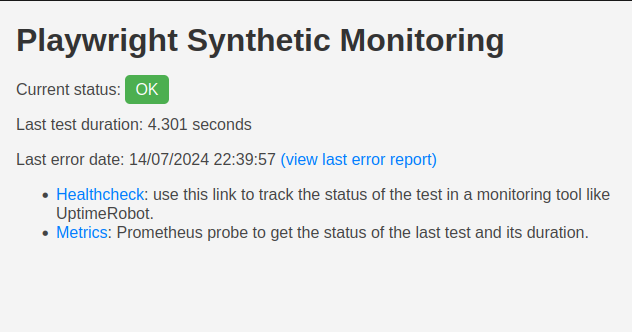

# Playwright Synthetic Monitoring

[](https://hub.docker.com/r/workadventure/playwright-synthetic-monitoring)
[](https://hub.docker.com/r/workadventure/playwright-synthetic-monitoring)
[](https://hub.docker.com/r/workadventure/playwright-synthetic-monitoring)

Playwright Synthetic Monitoring is a Docker image that allows you to monitor your website uptime using E2E Playwright tests.

## What does it do?



The image runs Playwright tests at regular interval (every 5 minutes by default).

The image does not provide any alerting mechanism. It will not send mails or SMS. Instead,
if provides 2 HTTP endpoints that an external monitoring tool can track.

It exposes:

- a Prometheus `/metrics` endpoint that you can scrape to get the test results
- a `/healthcheck` endpoint that will return an HTTP 200 if the tests are successful or an HTTP 500 status code if one of the tests are failing. The `/healthcheck` endpoint can be used with an uptime tracking tool like [UptimeRobot](https://uptimerobot.com).

In addition, it provides:

- a `/last-error` webpage that contains the results of the last failed Playwright report
- a `/` webpage to show the status of the last test and provide links to the other pages (see screenshot above)

> [!NOTE]  
> The `/last-error` page is available even after the tests run successfully again. This way, you can take your time
> to investigate what went wrong after recovery.


## Usage

You need to provide [Playwright tests](https://playwright.dev/docs/writing-tests) to the image.
Playwright tests will be read from the `/work/tests` directory.

All tests will be run. If any of the tests fails, the probe will return a "KO" status (i.e. a HTTP 500 if you are using
the `/healthcheck`) endpoint.

Here is an example test:

**tests/example.spec.ts**
```typescript
import { test, expect } from '@playwright/test';

test('has title', async ({ page }) => {
  await page.goto('https://example.com/');

  // Expect the page to contain the text "Example Domain"
  await expect(page.getByText('Example Domain')).toBeVisible();
});
```

Tests should end with ".spec.ts" or ".spec.js".

### With Docker

Assuming your tests are in the `./tests` directory, you can start the image with the following command:

```bash
docker run --rm -p 3000:3000 -v $(pwd)/tests:/work/tests:ro workadventure/playwright-synthetic-monitoring:latest
```

Open your browser at http://localhost:3000 to see the status of the last test.

### With Docker Compose

You can use the following `docker-compose.yml` file:

```yaml
version: '3.8'

services:
  playwright-synthetic-monitoring:
    image: workadventure/playwright-synthetic-monitoring:latest
    volumes:
      - ./tests:/work/tests:ro
    ports:
      - 3000:3000
```

Open your browser at http://localhost:3000 to see the status of the last test.

### Building your own image containing your tests

You can build your own image containing your tests.

Here is an example `Dockerfile`:

```Dockerfile
FROM workadventure/playwright-synthetic-monitoring:latest

COPY ./tests /work/tests
```

Then, build the image:

```bash
docker build -t my-playwright-tests .
```

### Helm deployment

This package comes with a Helm chart.
To use it, you will first need to create your own Docker image containing your tests (see above).

Then, you can create a `values.yaml` file:

```yaml
image:
  repository: my-repo.com/my-namespace/my-playwright-tests
  tag: latest
```

If your image is private, you can provide a `imagePullSecrets`:

```yaml
imageCredentials:
  # URL to the registry (i.e. my-registry.my-domain.com:444)
  registry: ""
  username: ""
  password: ""
  email: ""
```

You should then expose the service on an ingress.
Assuming you are using Nginx as an Ingress Controller and CertManager + Let's encrypt to manage your certificates, 
you can use the following configuration:

```yaml
ingress:
  enabled: true
  className: nginx
  annotations:
    kubernetes.io/ingress.class: nginx
    cert-manager.io/cluster-issuer: letsencrypt-prod
  hosts:
    - host: my-domain.com
      paths:
        - path: /
          pathType: ImplementationSpecific
  tls:
    - secretName: chart-example-tls
      hosts:
        - my-domain.com
```

Finally, you can deploy the Helm chart:

```bash
helm repo add workadventure https://charts.workadventu.re/
helm install playwright-synthetic-monitoring workadventure/playwright-synthetic-monitoring -f values.yaml
```


## Testing / debugging your tests

If you want to run your synthetic test only once and see the result, you can run the `npm run test` command inside the container.

```bash
docker run --rm -p 3000:3000 -v $(pwd)/tests:/work/tests:ro workadventure/playwright-synthetic-monitoring:latest npm run test
```

## Configuring the test interval

By default, the tests are run every 5 minutes.

You can configure the interval by setting the `MONITORING_INTERVAL` environment variable to the number of seconds between each test.

Note: the tests should of course be fast enough to complete in the interval you set. If the test does not complete in 
the `MONITORING_INTERVAL`, it will be killed and considered as failed.

## Configuring the base URL

You can configure the base URL of the tests with the `BASE_URL` environment variable.

## Configuring persistence trace directory
You can configure a directory to persist the traces of failed tests. `PERSIST_TRACE_DIRECTORY` defaults to `undefined` and no directory will be created. If set to `PERSIST_TRACE_DIRECTORY=coolDir` the directory `coolDir` will be created and traces will be copied.

> Traces will have a `DateTime` as filename.
> Example: `2025-04-24T14:57:49.662Z.zip`

## Prometheus endpoint

The Prometheus `/metrics` endpoint returns 2 metrics:

- **playwright_synthetic_monitoring_status**: Status of the last test. 1 if the last test was successful, 0 if it failed.
- **playwright_synthetic_monitoring_test_duration_seconds**: The duration in seconds of the last test.
